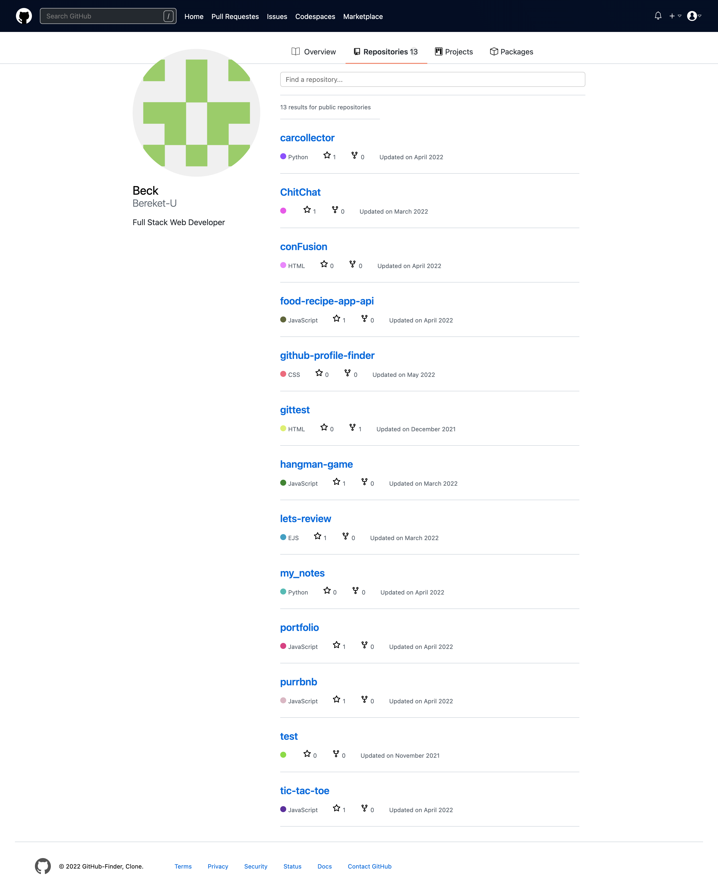

# GitHub Profile Finder Using Github Rest API

A simple Javascript application, Using the GitHub Rest API, recreated the GitHub profile page (the tab that lists a user's repositories).

---

## **Getting Started**

Here is a [Link](https://glistening-lokum-15880f.netlify.app/) to start live demo! Enjoy!

## Technologies Used

- HTML
- CSS
- JavaScript
- DOM Manipulation

---

## Added Features

### Search Github Username

Submitting the search input loads the profile page with the first 20 repositories.

---

## Screenshot

- [Home Page](#home-page)
- [Profile Page](#profile-page)

### Home Page

### Profile Page

